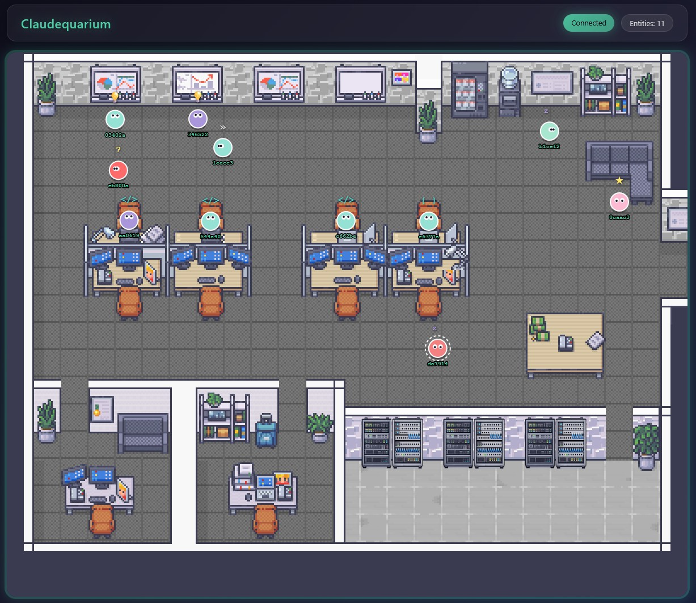

# Claudequarium

Claudequarium is a real-time visualization tool that brings your Claude Code sessions to life. Each time you start a Claude Code session and invoke the `/claudequarium` skill, a unique character spawns into a shared pixel art office environment.

As Claude reads files, writes code, plans tasks, or waits for input, your character moves around the virtual office performing contextual animations. Characters pace around thinking zones when Claude is searching through code, sit at desks when writing files, gather at whiteboards during planning, and wander the break room when idle.

Multiple Claude Code sessions can connect simultaneously, creating a virtual office where you can watch all your active agents work together in real time. The visualization updates instantly via WebSocket, so you always see what your agents are doing at a glance.



## Features

- Real-time visualization of Claude Code activity
- Characters move between zones based on agent state (thinking, coding, planning, idle)
- Wave animation when you say "wave" to your agent
- WebSocket-based live updates across multiple browser clients
- Cross-platform support (Windows, macOS, Linux)
- User authentication with admin controls
- System logs viewer for monitoring activity
- Configurable debug mode for development

## Quick Start

### 1. Start the Server

```bash
cd claudequarium-server
npm install
npm start
```

The server runs on `http://localhost:4000` by default.

### 2. Open the Visualization

Open `http://localhost:4000` in your browser.

### 3. Connect Claude Code

Run `/claudequarium` in any Claude Code session to spawn a character.

Or add the skill to your global settings (`~/.claude/settings.json`):

```json
{
  "skills": [
    "/path/to/chung-claudequarium/claudequarium-skill"
  ]
}
```

## Configuration

Server settings are stored in `claudequarium-server/config.env`:

```env
HOST=0.0.0.0        # 0.0.0.0 for network access, 127.0.0.1 for localhost only
PORT=4000
JWT_SECRET=your-secret-key-here
```

Copy `config.env.example` to `config.env` to get started.

## Authentication

Claudequarium includes a built-in authentication system:

- **Default Admin**: On first run, a default admin account is created (check server logs for credentials)
- **User Management**: Admins can create, edit, and delete users via Settings > User Accounts
- **Protected Features**: Logs, Settings, and Admin features require login
- **JWT Tokens**: Sessions are maintained via JWT tokens stored in localStorage

### Menu Access

| Logged Out | Logged In |
|------------|-----------|
| Login | Account |
| | Logs |
| | Settings |
| | Logout |

## Project Structure

```
chung-claudequarium/
├── claudequarium-server/
│   ├── src/                          # Backend server code
│   │   ├── index.js                  # Express + WebSocket server entry
│   │   ├── api.js                    # Entity REST API endpoints
│   │   ├── config.js                 # Server configuration loader
│   │   ├── entities.js               # Entity state management
│   │   ├── websocket.js              # WebSocket broadcast handling
│   │   └── site-framework/           # Auth & user management backend
│   │       ├── index.js              # Backend entry point
│   │       ├── database.js           # SQLite database setup
│   │       ├── auth.js               # JWT authentication middleware
│   │       └── routes.js             # Auth/users/logs API routes
│   │
│   ├── public/                       # Frontend static files
│   │   ├── index.html                # Main HTML page
│   │   ├── styles.css                # Main application styles
│   │   ├── assets/                   # Images and sprites
│   │   ├── data/                     # Map data JSON files
│   │   │
│   │   ├── js/                       # Game logic modules
│   │   │   ├── main.js               # Application entry point
│   │   │   ├── config.js             # Client configuration
│   │   │   ├── mapData.js            # Map data loading
│   │   │   ├── network.js            # WebSocket client
│   │   │   ├── pathfinding.js        # A* pathfinding algorithm
│   │   │   ├── state.js              # Game state management
│   │   │   ├── ui.js                 # UI helper functions
│   │   │   ├── entities/             # Entity system
│   │   │   │   ├── index.js          # Entity exports
│   │   │   │   ├── create.js         # Entity creation
│   │   │   │   ├── movement.js       # Movement logic
│   │   │   │   ├── state.js          # State transitions
│   │   │   │   ├── wandering.js      # Wandering behavior
│   │   │   │   └── utils.js          # Entity utilities
│   │   │   └── renderer/             # Rendering system
│   │   │       ├── index.js          # Renderer exports
│   │   │       ├── background.js     # Background rendering
│   │   │       ├── entity.js         # Entity sprite rendering
│   │   │       ├── eyes.js           # Eye animations
│   │   │       ├── indicators.js     # State indicators
│   │   │       └── animations/       # Special animations
│   │   │           └── wave.js       # Wave animation
│   │   │
│   │   ├── debug/                    # Debug module
│   │   │   ├── index.js              # Debug exports
│   │   │   ├── config.js             # Debug flags & persistence
│   │   │   ├── api.js                # Debug API calls
│   │   │   ├── controls.js           # Button handlers & shortcuts
│   │   │   ├── overlays.js           # Debug visualizations
│   │   │   └── styles.css            # Debug panel styles
│   │   │
│   │   └── site-framework/           # Reusable UI components
│   │       ├── css/
│   │       │   ├── variables.css     # Theme CSS variables
│   │       │   ├── components.css    # Buttons, fields, tables
│   │       │   └── modal.css         # Modal dialog styles
│   │       ├── js/
│   │       │   ├── index.js          # Component exports
│   │       │   ├── auth.js           # Client-side authentication
│   │       │   ├── modal.js          # Modal base class
│   │       │   ├── settings.js       # Settings modal
│   │       │   ├── logs.js           # Logs viewer modal
│   │       │   ├── toast.js          # Toast notifications
│   │       │   ├── table.js          # Sortable data tables
│   │       │   ├── field.js          # IFTA form fields
│   │       │   ├── menu.js           # Hamburger menu
│   │       │   └── loginModal.js     # Login dialog
│   │       └── README.md             # Component documentation
│   │
│   ├── db/                           # SQLite database (gitignored)
│   ├── map/                          # Tiled map editor files
│   │   ├── office_space.tmx          # Source map (edit in Tiled)
│   │   ├── office_space_data.json    # Parsed map data
│   │   ├── map-data/                 # Parser tools
│   │   ├── assets/                   # Tileset images
│   │   └── README.md                 # Map editing guide
│   ├── tests/                        # Utility scripts
│   │   ├── start.sh / start.ps1      # Server startup
│   │   └── stop.sh / stop.ps1        # Server shutdown
│   ├── config.env                    # Server configuration
│   └── package.json                  # Node.js dependencies
│
└── claudequarium-skill/
    ├── SKILL.md                      # Skill definition for Claude Code
    └── hooks/                        # Shell hook scripts
```

## How It Works

1. Claude Code invokes the `/claudequarium` skill
2. The skill spawns an entity via HTTP POST to the server
3. As Claude works, state updates are sent to the server
4. Server broadcasts state changes to all connected browsers via WebSocket
5. Browser renders animated characters with pathfinding and state-based animations

## Entity States

| State | Trigger | Behavior |
|-------|---------|----------|
| THINKING | Read, Grep, Glob, WebSearch | Wanders in thinking zone |
| CODING | Write, Edit, Bash | Works at assigned desk |
| PLANNING | TodoWrite, EnterPlanMode | Stands at whiteboard |
| IDLE | Waiting for user input | Roams between idle zones |

## Commands

When connected via `/claudequarium`:

- Say "wave" to make your character wave at the viewer
- Say "goodbye" or end the session to despawn your character

## Scripts

Utility scripts are located in `claudequarium-server/tests/`:

**Linux/macOS:**
```bash
cd claudequarium-server/tests
./start.sh    # Start server
./stop.sh     # Stop server
```

**Windows PowerShell:**
```powershell
cd claudequarium-server/tests
./start.ps1   # Start server
./stop.ps1    # Stop server
```

*Note: The preferred method is `npm start` from the `claudequarium-server` directory.*

## API Endpoints

### Entity API

| Endpoint | Method | Description |
|----------|--------|-------------|
| `/api/spawn` | POST | Spawn a new entity |
| `/api/state` | POST | Update entity state |
| `/api/wave` | POST | Trigger wave animation |
| `/api/despawn` | POST | Remove an entity |
| `/api/entities` | GET | List all entities (debug) |
| `/health` | GET | Server health check |

### Auth API

| Endpoint | Method | Description |
|----------|--------|-------------|
| `/api/auth/login` | POST | Login with username/password |
| `/api/auth/me` | GET | Get current user info |
| `/api/users` | GET | List all users (admin) |
| `/api/users` | POST | Create new user (admin) |
| `/api/users/:id` | PUT | Update user (admin) |
| `/api/users/:id` | DELETE | Delete user (admin) |
| `/api/logs` | GET | Get system logs (admin) |

## Debug Mode

Debug controls can be enabled via Settings > Site Settings > Developer Options.

When enabled, a debug panel appears below the game canvas with:
- Entity spawn/despawn controls
- State change buttons
- Overlay toggles

### Keyboard Shortcuts

| Key | Action |
|-----|--------|
| `S` | Spawn test entity |
| `W` | Wave (selected entity) |
| `1-4` | Set state (Thinking/Planning/Coding/Idle) |
| `C` | Toggle collision grid |
| `Z` | Toggle zone boundaries |
| `P` | Toggle pathfinding visualization |
| `I` | Toggle entity info |

## Site Framework

Claudequarium includes a reusable UI component library with glass-panel aesthetics:

- **Glass Panels**: Frosted glass containers with backdrop blur
- **IFTA Fields**: Inline Floating Top-Aligned label inputs
- **Buttons**: Primary, secondary, and danger variants
- **Tables**: Sortable data tables with actions
- **Modals**: Dialogs with dirty-form detection
- **Toasts**: Bottom-right notification system

See `public/site-framework/README.md` for component documentation.

## License


